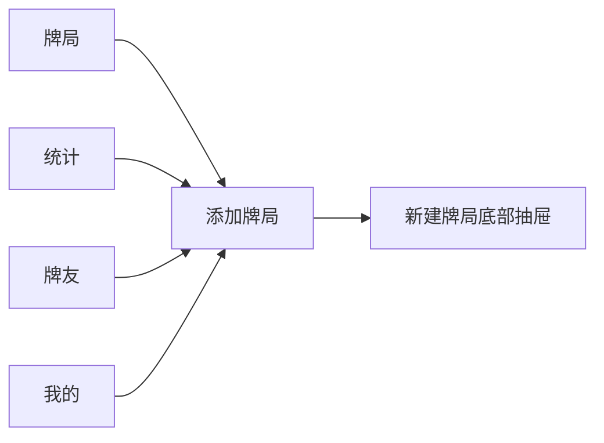
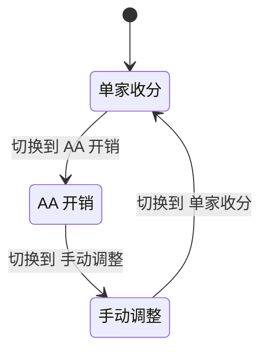
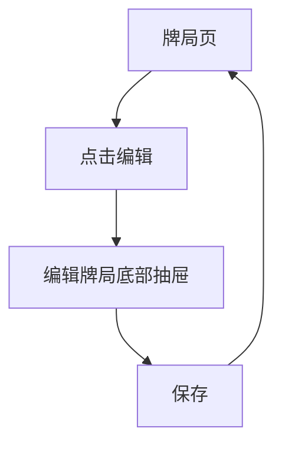
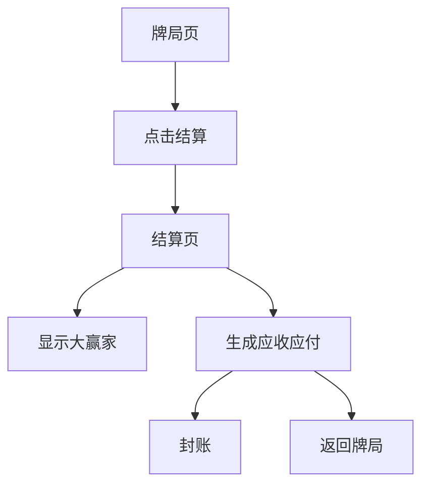
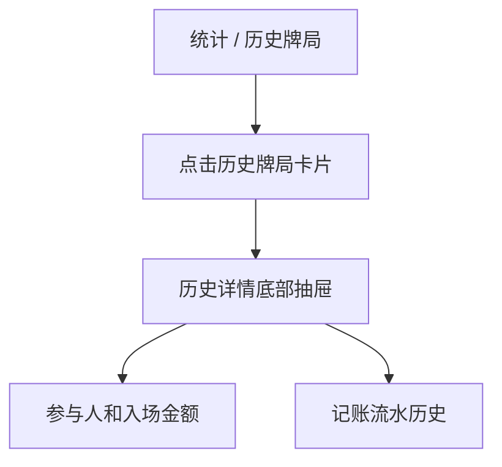

# 麻将记账 APP 原型开发说明

本文档用于把当前 Web 原型转化为开发可执行的页面结构、状态逻辑和业务流程说明。原型文件位于：

- `prototype/prototype-web/index.html`
- `prototype/prototype-web/style.css`

## 页面总览

当前原型画布包含以下页面/状态：

1. 牌局页：单家收分状态
2. 牌局页：AA 开销状态
3. 牌局页：手动调整状态
4. 编辑牌局底部抽屉
5. 结算页
6. 统计页：全部
7. 统计页：本周
8. 统计页：本月
9. 统计页：历史牌局
10. 历史牌局详情底部抽屉
11. 牌友页
12. 我的页
13. 新建牌局底部抽屉

> 截图说明：Codex Browser 当前阻止自动截取 `file:///D:/...` 本地页面。截图需在浏览器中手动导出或后续在允许的本地预览服务上补充。

## 全局交互规则

- 所有页面内容区域为可滚动窗口。
- 手机状态栏和页面标题作为一个整体固定在顶部。
- 底部导航始终悬浮固定在页面底部。
- 统计页中，标题和时间范围 Switch 固定。
- 牌友页中，标题和搜索框固定。
- 子卡片、按钮、输入框、底部导航统一使用同一圆角系统。
- 中文文本使用统一中文字体栈，数字金额使用统一数字字体并启用等宽数字。

## 底部导航

底部导航包含 5 个位置：

- 牌局
- 统计
- 添加牌局
- 牌友
- 我的

`添加牌局` 是主操作按钮，不是普通 Tab。点击后弹出新建牌局底部抽屉。



## 牌局页

牌局页是当前牌局的实时记账工作台。

固定顶部：

- 状态栏
- 当前牌局标题，例如 `今晚南山局`

页面内容：

- 参与人和入场金额
- 编辑 / 结算并排按钮
- 当前账面
- 记账输入
- 进出账历史

### 牌局页状态

记账输入由三段 Switch 控制：

- 单家收分
- AA 开销
- 手动调整

同一牌局页中只展示当前选中的一个子卡片内容。原型中用三个牌局页面状态表达 Switch 切换结果。



### 单家收分

用于一位玩家收分，系统自动分摊到输家。

字段：

- 收分玩家
- 金额
- 输家分摊结果

提交后：

- 写入进出账历史
- 更新每位玩家当前账面

### AA 开销

用于茶水、包间、外卖等共同支出。

字段：

- 付款人
- 总金额
- 参与分摊玩家
- 自动计算每人分摊金额

提交后：

- 付款人增加应收或少扣账面
- 其他参与者扣除分摊金额
- 写入进出账历史

### 手动调整

用于修正录错、补录或特殊约定。

字段：

- 调整对象
- 调整金额
- 调整原因

提交后：

- 修改指定玩家账面
- 写入进出账历史并保留调整原因

## 编辑牌局抽屉

入口：牌局页 `编辑` 按钮。

展示方式：从底部弹出的抽屉。

可编辑内容：

- 牌局名称
- 参与人姓名
- 每位参与人的入场金额
- 开始时间
- 备注，例如地点

保存后：

- 返回牌局页
- 更新顶部牌局名
- 更新参与人和当前账面基础数据



## 结算页

入口：牌局页 `结算` 按钮。

顶部：

- 返回图标
- 牌局名称

内容：

- 大赢家
- 整场统计
- 应收应付列表
- 封账
- 返回牌局

结算规则：

- 根据当前账面计算正负余额。
- 正数玩家为应收方。
- 负数玩家为应付方。
- 生成最少转账路径或清晰的应收应付列表。



## 统计页

统计页由四个 Switch 子页面组成：

- 全部
- 本周
- 本月
- 历史牌局

### 全部

展示长期总览：

- 总输赢
- 胜率
- 牌局数
- 整体走势
- 胜率最高牌友

### 本周

展示短周期复盘：

- 本周输赢
- 本周胜率
- 本周牌局数
- 本周牌局节奏
- 本周建议

### 本月

展示月度表现：

- 本月输赢
- 平均时长
- 本月牌局数
- 本月走势
- 常见牌局组合

### 历史牌局

以纵向卡片列表展示历史牌局。

每张卡片包含：

- 牌局名称
- 赢家
- 参与人数
- 参与者
- 参与者入场金额

点击卡片后：

- 从底部弹出历史牌局详情抽屉

## 历史牌局详情抽屉

入口：统计页 `历史牌局` 卡片。

展示方式：底部抽屉。

内容：

- 牌局名称
- 赢家
- 参与人
- 入场金额
- 当前牌局记账流水历史



## 牌友页

固定顶部：

- 状态栏
- 牌友标题
- 搜索框

内容：

- 牌友列表
- 每位牌友的对局次数
- 同桌胜率
- 与该牌友相关的输赢金额

当前右上角新增按钮暂不展示，后续迭代再补。

点击搜索框后进入牌友搜索态：

- 底部导航暂时隐藏，顶部固定搜索输入栏和“取消”操作。
- 搜索框保持圆角浅色原生输入形态，左侧搜索符号，输入后右侧展示清除按钮。
- 未输入时展示最近搜索、常搜牌友、相关牌局。
- 输入后展示“搜索结果 + 数量”，结果同时包含牌友和相关牌局。
- 无结果时展示轻量空态，不弹窗、不使用跨端 H5 风格浮层。

## 我的页

内容：

- 账户与数据标题
- 账号/本地账本信息
- 本地备份
- 导出账本
- 数据管理
- 在线模式设置
- 关于

当前右上角设置按钮暂不展示，后续迭代再补。

## 核心数据结构建议

```ts
type Player = {
  id: string
  name: string
  buyIn: number
  balance: number
}

type Game = {
  id: string
  name: string
  mode: 'offline' | 'online'
  status: 'active' | 'settled' | 'closed'
  startedAt: string
  note?: string
  players: Player[]
  entries: LedgerEntry[]
}

type LedgerEntry =
  | SingleIncomeEntry
  | AAExpenseEntry
  | ManualAdjustEntry

type SingleIncomeEntry = {
  type: 'single_income'
  receiverId: string
  amount: number
  payerIds: string[]
  createdAt: string
}

type AAExpenseEntry = {
  type: 'aa_expense'
  payerId: string
  amount: number
  participantIds: string[]
  createdAt: string
}

type ManualAdjustEntry = {
  type: 'manual_adjust'
  playerId: string
  amount: number
  reason: string
  createdAt: string
}
```

## 开发优先级

1. 离线牌局数据模型
2. 创建牌局
3. 编辑牌局
4. 三种记账输入
5. 当前账面计算
6. 进出账历史
7. 结算页和应收应付计算
8. 统计页
9. 牌友页
10. 我的页数据管理
