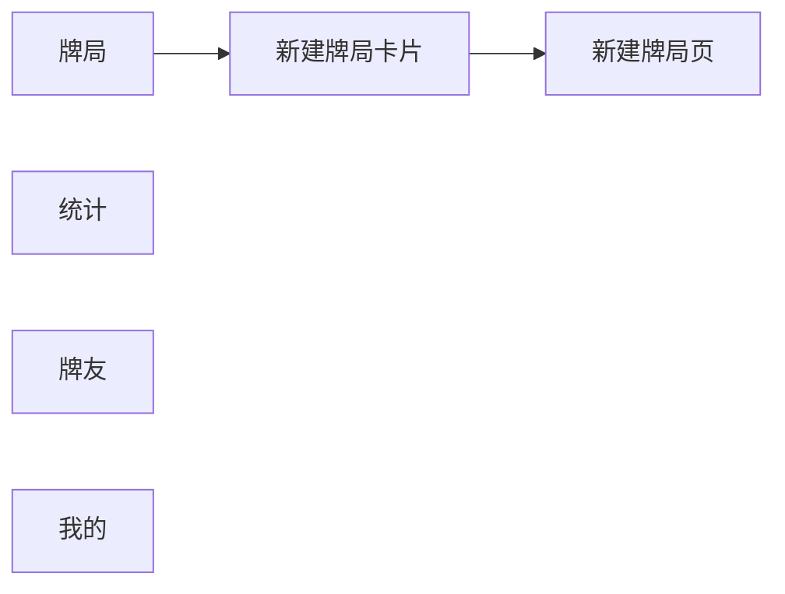
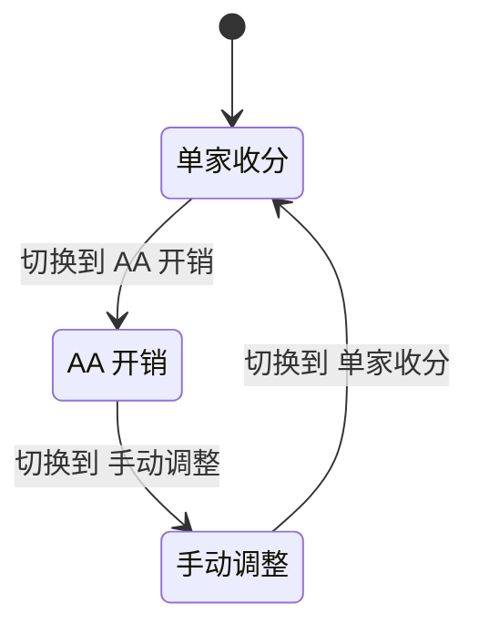
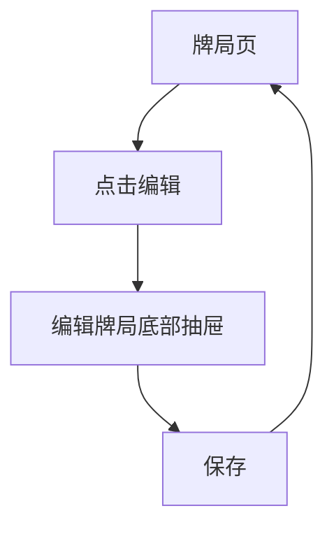
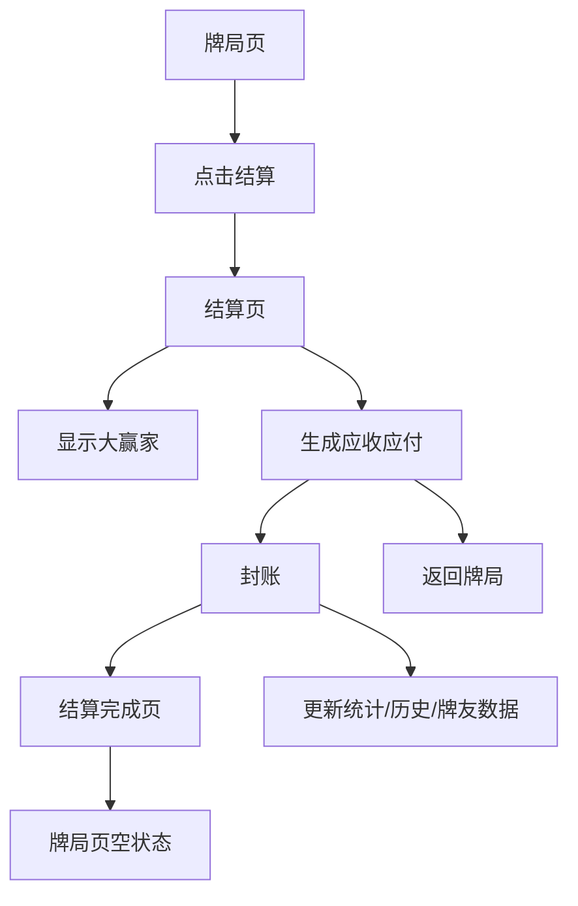
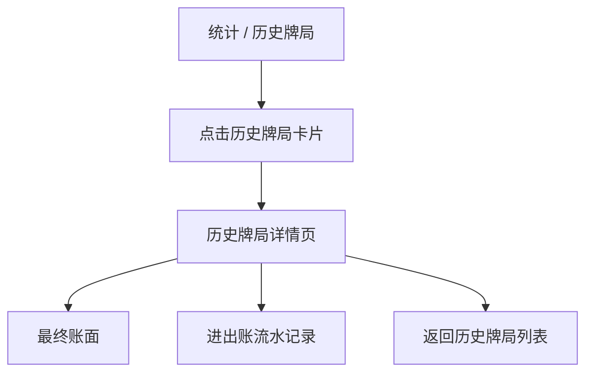

# 麻将记账 APP 原型开发说明

本文档用于把当前 Web 原型转化为开发可执行的页面结构、状态逻辑和业务流程说明。原型文件位于：

- `prototype/prototype-web/index.html`
- `prototype/prototype-web/style.css`

## 页面总览

当前原型画布包含以下页面/状态：

1. 牌局页：无进行中牌局状态
2. 新建牌局页
3. 新建牌局页：牌友抽屉选择态
4. 牌局页：单家收分状态
5. 牌局页：AA 开销状态
6. 牌局页：手动调整状态
7. 编辑牌局底部抽屉
8. 结算页
9. 结算完成页
10. 统计页：全部
11. 统计页：历史牌局
12. 历史牌局详情页
13. 牌友页
14. 牌友页：搜索态
15. 我的页

> 截图说明：Codex Browser 当前阻止自动截取 `file:///D:/...` 本地页面。截图需在浏览器中手动导出或后续在允许的本地预览服务上补充。

## 全局交互规则

- 所有页面内容区域为可滚动窗口。
- 手机状态栏和页面标题作为一个整体固定在顶部；主页面标题只展示大标题，不展示标题上方的小字说明。
- 底部导航始终悬浮固定在页面底部。
- 牌局、统计、牌友、我的四个主页面支持左右滑动切换，滑动后同步更新底部导航选中态。
- 统计页中，标题和时间范围 Switch 固定。
- 牌友页中，标题和搜索框固定。
- 子卡片、按钮、输入框、底部导航统一使用同一圆角系统。
- 所有按钮、可点击小胶囊、可点击列表行和可点击卡片都需要有按压缩小反馈，用于明确表达“已点击/正在点击”状态。
- 中文文本使用统一中文字体栈，数字金额使用统一数字字体并启用等宽数字。
- Web 原型画布中的页面顺序必须按用户完成核心流程的顺序摆放：先走完牌局创建、记账、编辑和结算，再进入统计、牌友、我的等后续模块；同一模块的详情页或状态页紧跟入口页。

## 底部导航

底部导航包含 4 个位置：

- 牌局
- 统计
- 牌友
- 我的

全局 `+` 新建按钮已取消。无进行中牌局时，牌局页只展示标题和一张新建牌局卡片；点击卡片跳转到新建牌局页。

选中页面的导航图标和文字使用蓝色，未选中页面的图标和文字统一使用灰色。



## 牌局页

牌局页根据是否存在进行中牌局展示不同内容。

### 无进行中牌局

固定顶部：

- 状态栏
- 页面标题：`牌局`

页面内容：

- 仅展示一张新建牌局卡片，文案为 `点击此处开启一场牌局吧`
- 点击卡片跳转到新建牌局页

### 有进行中牌局

有进行中牌局时，牌局页是当前牌局的实时记账工作台。

固定顶部：

- 状态栏
- 当前牌局标题，例如 `今晚南山局`

页面内容：

- 牌友和入场金额
- 编辑 / 结算并排按钮
- 当前账面
- 记账输入
- 进出账历史

牌友和入场金额卡片中，四位牌友按等宽横向 1x4 排列；每格展示牌友姓名和入场金额，上下两行居中。该区域需要横向占满卡片内容宽度，并与下方 `编辑 / 结算` 两个按钮的左右边界对齐。

### 牌局页状态

记账输入由三段 Switch 控制：

- 单家收分
- AA 开销
- 手动调整

同一牌局页中只展示当前选中的一个子卡片内容。原型中用三个牌局页面状态表达 Switch 切换结果。



### 单家收分

用于一位牌友收分，系统自动分摊到输家。

字段：

- 收分牌友
- 金额
- 输家分摊结果

提交后：

- 写入进出账历史
- 更新每位牌友当前账面

### AA 开销

用于茶水、包间、外卖等共同支出。

字段：

- 付款人
- 总金额
- 参与分摊牌友
- 自动计算每人分摊金额

提交后：

- 付款人增加应收或少扣账面
- 其他牌友扣除分摊金额
- 写入进出账历史

### 手动调整

用于修正录错、补录或特殊约定。

字段：

- 调整对象
- 调整金额
- 调整原因

提交后：

- 修改指定牌友账面
- 写入进出账历史并保留调整原因

## 新建牌局页

入口：牌局页空状态中的新建牌局卡片。

固定顶部：

- 状态栏
- 左侧返回箭头，点击返回牌局页
- 页面标题：`新建牌局`

页面内容：

- 引导说明卡片
- 牌局信息：牌局名称
- 牌友和入场金额：四位牌友姓名和入场金额
- 开始记账按钮

### 牌友输入规则

新建牌局页默认只固定当前用户“我”为牌友 1；其余三位牌友姓名和四位入场金额都保持空白，不预填模拟牌友或默认金额。每行左侧使用 `牌友1` / `牌友2` / `牌友3` / `牌友4` 文字标签，不使用姓名缩写圆形图标。

牌友 1 为当前用户固定展示，不使用输入框或下拉框。牌友 2 到牌友 4 的姓名控件由输入区和右侧箭头触发区组成：

- 点击输入框主体时，进入正常文本输入状态，显示文本光标，不弹出选择列表。
- 点击输入框右侧下拉箭头时，从底部弹出牌友选择抽屉。
- 牌友选择抽屉展示可滚动的本地已有牌友列表，并可按输入内容过滤；抽屉不展示当前用户“我”；抽屉覆盖在页面上方，不参与表单布局，不应把后续输入行挤开。
- 从抽屉列表选择时，使用已有牌友 ID。
- 抽屉列表只展示已存在牌友，不展示“新建牌友”选项，也不展示“完成”按钮；暂无牌友时展示“目前暂时还没有牌友”一类空态文案。
- 直接输入姓名时，如果本地已有同名牌友，则自动选择已有牌友，不创建重复牌友。
- 直接输入姓名时，如果本地不存在同名牌友，则输入框当前姓名默认为新建牌友，保存牌局时同步创建本地牌友，并使用新牌友 ID。
- 同一场牌局中不得选择或输入重复牌友；如重复，应提示用户或自动聚焦到已存在的同名牌友。
- 入场金额不预填默认值，创建牌局前必须填写并通过非负数校验。
- 牌友去重时以规范化姓名为准，至少应忽略首尾空格。

## 编辑牌局抽屉

入口：牌局页 `编辑` 按钮。

展示方式：从底部弹出的抽屉。

可编辑内容：

- 牌局名称
- 牌友姓名
- 每位牌友的入场金额

保存后：

- 返回牌局页
- 更新顶部牌局名
- 更新牌友和当前账面基础数据



## 结算页

入口：牌局页 `结算` 按钮。

顶部：

- 返回图标
- 牌局名称

内容：

- 大赢家
- 整场统计
- 应收应付列表：按牌友展示名称、入场金额和带正负号/语义色的最终账面金额
- 最佳转账路径：用最少步骤展示付款人、收款人和转账金额
- 封账
- 返回牌局

结算规则：

- 根据当前账面计算正负余额。
- 正数牌友为应收方。
- 负数牌友为应付方。
- 应收应付列表不展示“谁付给谁”，只展示每位牌友的最终应收/应付金额。
- 最佳转账路径单独成卡片，展示最少转账步骤。
- 点击 `封账` 后，将当前牌局状态更新为已结算/已封账，写入同步操作日志，清空当前进行中牌局，并跳转到结算完成页。
- 封账完成后，牌局页恢复为无进行中牌局状态，只展示新建牌局卡片。
- 统计页、历史牌局、牌友同桌数据等展示必须从已封账牌局重新派生，包含上一场牌局的赢家、金额、牌友和流水结果。

## 结算完成页

入口：结算页 `封账` 按钮。

页面内容应极简：

- 只展示一段恭喜当前牌局赢家的文字和赢的金额，例如 `恭喜我成为今晚南山局大赢家 +56`
- 下方展示 `返回牌局` 按钮

返回后：

- 回到牌局页无进行中牌局状态
- 页面只展示新建牌局卡片
- 上一场牌局结果已进入统计、历史牌局和牌友表现数据



## 统计页

统计页由两个 Switch 子页面组成：

- 全部
- 历史牌局

全部子页面采用以下卡片结构：

- 总览
- 最近封账
- 走势
- 胜率最高牌友

### 全部

展示长期总览：

- 总输赢
- 胜率
- 牌局数
- 整体走势，折线点位需要显示日期标签
- 胜率最高牌友

总览卡三项数据需要保持同等级元素对齐：label、主数值、单位各自使用一致高度，使主数值在同一水平线上。

### 历史牌局

以纵向卡片列表展示历史牌局，不再额外包一层“历史牌局”父卡片。

历史牌局卡片需要展示：

- 牌局日期
- 参与人名称
- 赢家和赢家金额
- 输家和输家金额
- 入场金额总览

每张卡片包含：

- 牌局名称
- 赢家
- 牌友数
- 牌友
- 牌友入场金额

点击卡片后：

- 跳转到历史牌局详情页

## 历史牌局详情页

入口：统计页 `历史牌局` 卡片。

展示方式：整页详情，顶部提供返回历史牌局列表的箭头。

内容：

- 牌局概览卡片：展示牌局名称、牌局日期、封账状态、牌友数、流水数、大赢家和金额、大输家和金额、参与人名称、入场金额总览
- 最终账面卡片：展示每位牌友的入场金额、最终输赢和赢家标识
- 进出账流水记录卡片：展示封账前所有流水记录、类型、时间、分摊说明和金额
- 其他辅助信息可从已封账牌局派生，例如总入场、流水笔数、AA 开销和手动调整数量

业务逻辑：

- 历史详情只读取已封账牌局快照，不依赖当前进行中牌局。
- 最终账面从 `sessions + users + rounds` 的封账结果派生；各牌友最终金额合计必须为 0。
- 流水记录按发生时间倒序展示，作废或冲正记录需要保留可追溯信息。
- 从历史详情返回统计历史列表时，不修改任何业务数据。



## 牌友页

固定顶部：

- 状态栏
- 牌友标题
- 搜索框

内容：

- 牌友列表
- 每位牌友的对局次数
- 同桌胜率
- 与该牌友相关的输赢金额
- 暂无牌友时展示“暂无牌友”轻量空态，不让搜索框下方留白

当前右上角新增按钮暂不展示，后续迭代再补。

点击搜索框后进入牌友搜索态：

- 底部导航暂时隐藏，顶部固定搜索输入栏和“取消”操作。
- 搜索框保持圆角浅色原生输入形态，左侧搜索符号，输入后右侧展示清除按钮。
- 未输入时展示最近搜索、常搜牌友、相关牌局。
- 输入后展示“搜索结果 + 数量”，结果同时包含牌友和相关牌局。
- 无结果时展示轻量空态，不弹窗、不使用跨端 H5 风格浮层。

## 我的页

内容：

- 我的牌局所有统计情况，例如总输赢、胜率、总牌局、最大单局、平均时长、同桌牌友数；统计卡片不显示“所有统计”标题
- 关于
- 清空所有数据按钮，使用红色风险标识

当前右上角设置按钮、本地备份、导出账本、在线模式设置等入口暂不展示。

业务逻辑：

- 我的牌局统计从已封账牌局派生，不展示未封账草稿。
- 点击清空所有数据前，后续 App 实现必须提供二次确认；确认后清空本地仓储中的用户、牌局、流水、同步日志等本地数据，并回到无进行中牌局状态。

## 核心数据结构建议

```ts
type Player = {
  id: string
  name: string
  buyIn: number
  balance: number
}

type Game = {
  id: string
  name: string
  mode: 'offline' | 'online'
  status: 'active' | 'settled' | 'closed'
  startedAt: string
  note?: string
  players: Player[]
  entries: LedgerEntry[]
}

type LedgerEntry =
  | SingleIncomeEntry
  | AAExpenseEntry
  | ManualAdjustEntry

type SingleIncomeEntry = {
  type: 'single_income'
  receiverId: string
  amount: number
  payerIds: string[]
  createdAt: string
}

type AAExpenseEntry = {
  type: 'aa_expense'
  payerId: string
  amount: number
  participantIds: string[]
  createdAt: string
}

type ManualAdjustEntry = {
  type: 'manual_adjust'
  playerId: string
  amount: number
  reason: string
  createdAt: string
}
```

当前 ArkTS MVP 中 `GameSession` 使用 `playerIds` 记录牌友，并使用 `buyIns: Record<string, number>` 记录每位牌友的入场金额；编辑牌局会产生 `update_session` 操作，编辑牌友姓名会产生 `update_user` 操作，便于后续替换为关系型数据库和云同步时复用同一业务事件。

## 鸿蒙状态架构原则

后续开发以 HarmonyOS NEXT / ArkTS / ArkUI 的状态管理方式落地，不照搬其他平台框架。

- 公共业务数据以 `LedgerStore` / `LedgerRepository` 作为唯一事实来源，管理 `users`、`groups`、`sessions`、`rounds`、`operations`。
- 页面只保存 UI 状态：当前 Tab、当前选中牌局 ID、当前选中历史牌局 ID、Sheet 打开状态、筛选条件、输入框草稿等。
- 牌局页展示数据必须从 `currentSession + users + rounds` 派生，包括牌友、入场金额、总入场、当前账面、进出账流水、结算行和历史详情。
- 新建牌局页使用页面表单草稿，编辑牌局 Sheet 使用半模态表单草稿；点击保存后通过仓储 action 一次性提交，取消或返回时不得污染真实牌局数据。
- 所有业务动作必须走统一仓储 action 和统一刷新入口。新建牌局、编辑牌局、新增流水、作废流水、封账、同步完成后，都应重新读取仓储快照，再由 selector/派生函数计算 UI 展示。
- 页面不得长期保存 `setupName0..3`、`setupBuyIn0..3`、`balance0..3` 等重复业务事实。若 ArkUI 需要显式刷新触发，只保留类似 `ledgerViewRevision` 的轻量版本号；版本号只驱动重建，不保存业务值。
- `bindSheet` 半模态保存流程必须按顺序执行：表单草稿校验 -> 仓储 action 提交 -> 当前页面 `refresh()` -> 关闭 Sheet -> 关闭动画完成后再次统一 `refresh()`。这样可以避免底层页面处于半模态旧快照，导致切换 Tab 后才刷新。
- 本地临时数据存储仅用于表单草稿、筛选条件、当前 Tab、Sheet 开关等 UI 状态；不得用 `AppStorage` / `LocalStorage` 或页面级临时变量替代 `LedgerRepository` 中的牌局、牌友、入场金额、流水和账面事实。
- 复杂可观察对象可使用 ArkUI `@Observed` / `@ObjectLink` 承接；父子表单输入使用 `@Link` / `@Prop`；页面树共享状态可使用 `@Provide` / `@Consume`。
- `AppStorage` / `LocalStorage` 仅用于合适作用域的应用级或 UIAbility 级共享状态，不应作为普通事件总线或刷新通知滥用。
- 当前账面、统计、结算等金额结果优先从流水和牌局配置计算，不应在多个页面长期保存重复副本。

### 牌局编辑刷新验收口径

编辑牌局保存后，以下内容必须在 Sheet 关闭回到牌局页时立即更新，不需要用户切换 Tab 或重启页面：

- 顶部牌局标题。
- 牌友和入场金额胶囊。
- 当前账面中的总入场和四名牌友账面。
- 进出账历史中的入场金额调整流水。
- 结算页和历史详情中依赖相同仓储数据的展示。

## 开发优先级

1. 离线牌局数据模型
2. 创建牌局
3. 编辑牌局
4. 三种记账输入
5. 当前账面计算
6. 进出账历史
7. 结算页和应收应付计算
8. 统计页
9. 牌友页
10. 我的页统计、关于和清空数据

## V1.0 剩余收口

V1.0 先完成离线版本，不把登录、邀请加入、云同步、权限控制、账单分享、本地备份和设置增强作为发布阻塞项。当前剩余优先级如下：

1. 本地持久化：使用 HarmonyOS 本地持久化能力保存用户、账本组、牌友、牌局、流水和操作日志，关闭或重启 App 后数据不丢失。
2. 流水撤回 / 修改 / 删除：在进行中牌局的流水列表和历史详情中补齐修正入口，所有修正必须走 repository action，生成操作日志，并让账面、统计、结算和历史详情从有效流水重新派生。
3. 完整历史与流水查看：进行中牌局流水、历史牌局列表和历史详情不得只展示前几条记录；需要支持完整滚动、加载更多或分页。
